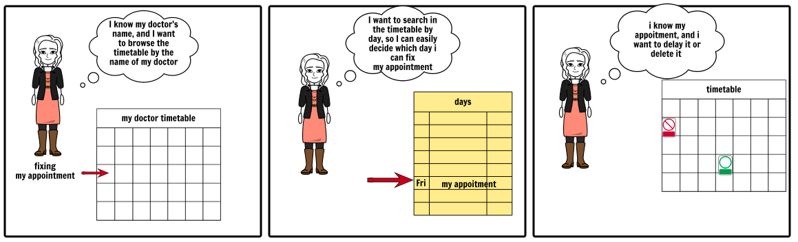

# Medical-Appointments-System

## Overview

For medical patients, secretary and doctors who works and visits the doctor's office, MyDoc is a
mobile and web solution that manages and schedule the medical appointments to facilitate the work for the
secretary and for the patients and ask for recommendations from the doctor using a chat platform;
unlike the traditional way by using the phone to ask for an appointment or visit the place itself for
seeing the doctor.

Here is a sample story board of the main purpose of this system : 

| Problem scenarios        | Current alternative           | Value proposition  |
| ------------- |:-------------:| -----:|
| The secretary must remind
every patient one day before
their appointments, which is
very difficult for her      | she got to search the phone
number of the patient, call it
and remind it.
In the case where the patient
didn't respond, she got to recall
it later | The patients receive
notifications on their phone
automatically.
The patient can manage the
settings of how the
notifications would be
received... |
| col 2 is      | centered      |   $12 |
| zebra stripes | are neat      |    $1 |

